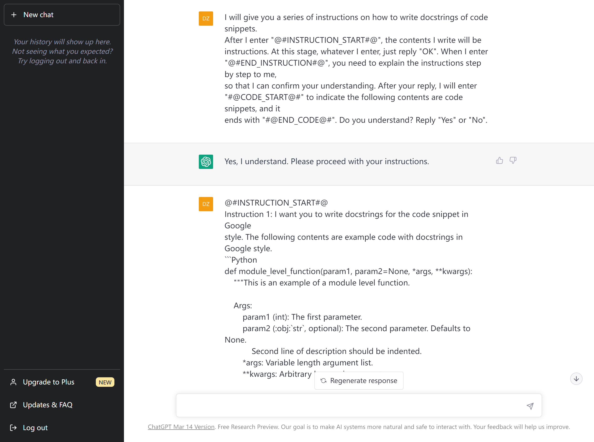
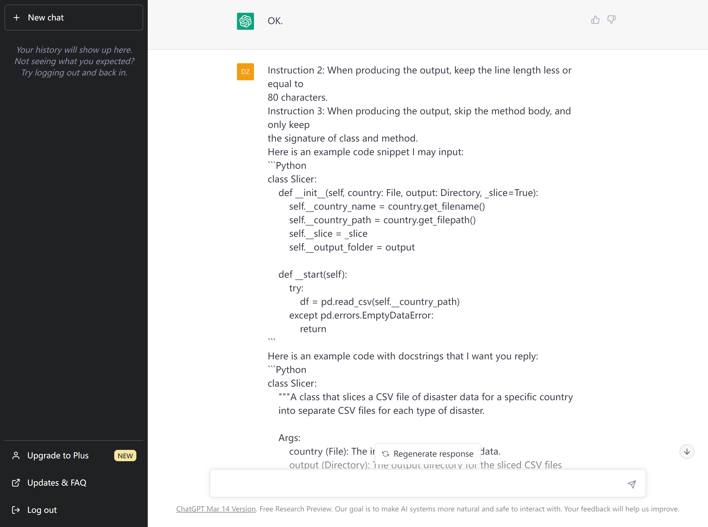
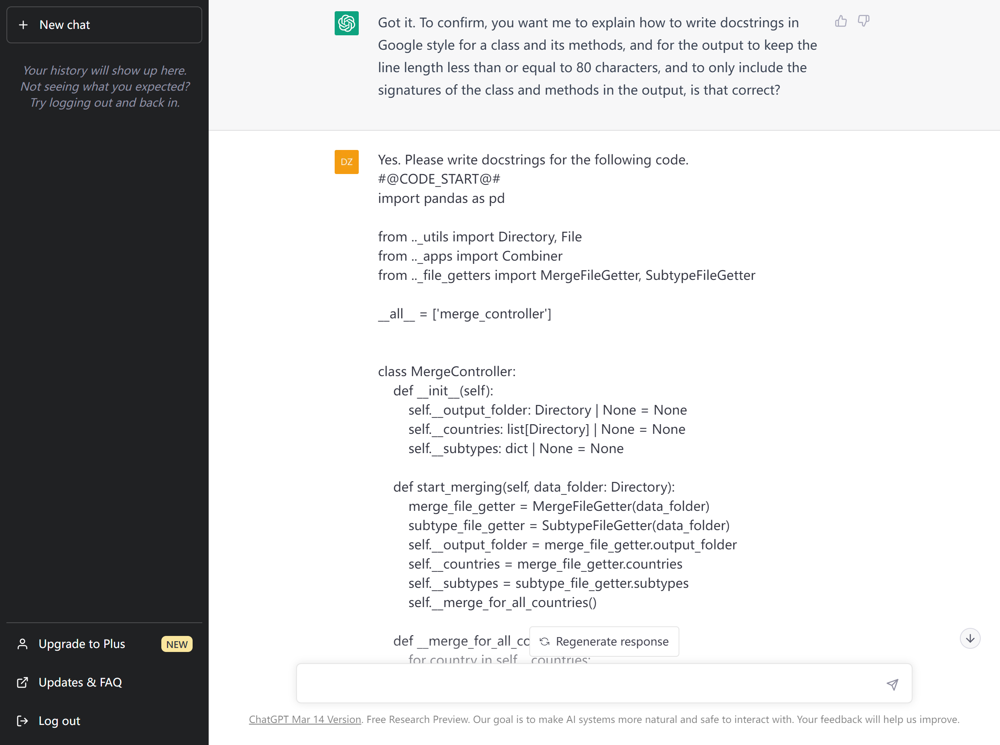
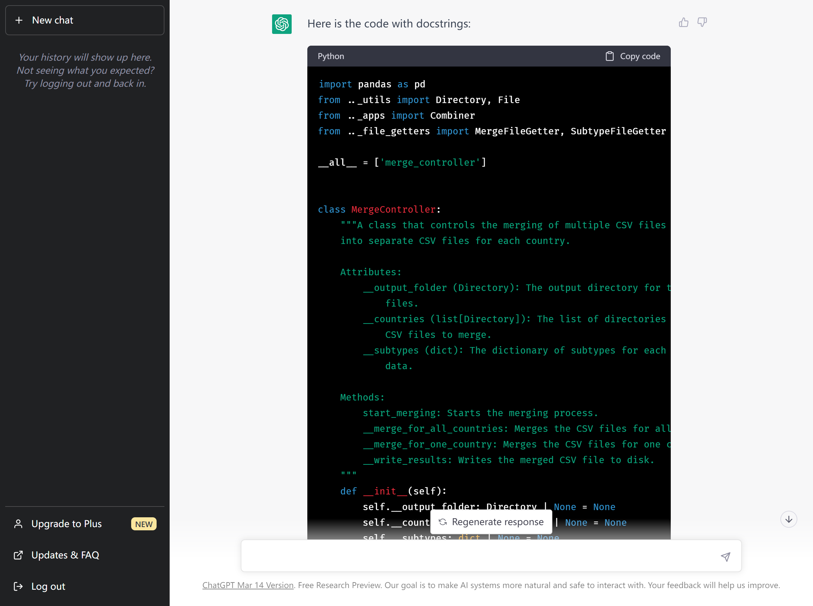

# chatgpt-docstring-prompt
A series of instructions to let ChatGPT to generate docstrings for your code

## First try

### dialog 1
```
I will give you a series of instructions on how to write docstrings of code 
snippets.
After I enter "@#INSTRUCTION_START#@", the contents I write will be 
instructions. At this stage, whatever I enter, just reply "OK". When I enter 
"@#END_INSTRUCTION#@", you need to explain the instructions step by step to me,
so that I can confirm your understanding. After your reply, I will enter 
"#@CODE_START@#" to indicate the following contents are code snippets, and it
ends with "#@END_CODE@#". Do you understand? Reply "Yes" or "No".
```

### dialog 2
````
@#INSTRUCTION_START#@
Instruction 1: I want you to write docstrings for the code snippet in Google 
style. The following contents are example code with docstrings in Google style.
```Python
def module_level_function(param1, param2=None, *args, **kwargs):
    """This is an example of a module level function.

    Args:
        param1 (int): The first parameter.
        param2 (:obj:`str`, optional): The second parameter. Defaults to None.
            Second line of description should be indented.
        *args: Variable length argument list.
        **kwargs: Arbitrary keyword arguments.

    Returns:
        bool: True if successful, False otherwise.

    Raises:
        AttributeError: The ``Raises`` section is a list of all exceptions
            that are relevant to the interface.
        ValueError: If `param2` is equal to `param1`.

    """
    if param1 == param2:
        raise ValueError('param1 may not be equal to param2')
    return True


def example_generator(n):
    """Generators have a ``Yields`` section instead of a ``Returns`` section.

    Args:
        n (int): The upper limit of the range to generate, from 0 to `n` - 1.

    Yields:
        int: The next number in the range of 0 to `n` - 1.

    Examples:
        Examples should be written in doctest format, and should illustrate how
        to use the function.

        >>> print([i for i in example_generator(4)])
        [0, 1, 2, 3]

    """
    for i in range(n):
        yield i


class ExampleClass(object):
    """The summary line for a class docstring should fit on one line.

    Args:
        param1 (str): Description of `param1`.
        param2 (:obj:`int`, optional): Description of `param2`. Multiple lines 
            are supported.

    Attributes:
        attr1 (str): Description of `attr1`.
        attr2 (:obj:`int`, optional): Description of `attr2`.

    """
    def __init__(self, param1, param2):
        self.attr1 = param1
        self.attr2 = param2
```
````

### dialog 3
````
Instruction 2: When producing the output, keep the line length less or equal to 
80 characters.
Instruction 3: When producing the output, skip the method body, and only keep 
the signature of class and method.
Here is an example code snippet I may input:
```Python
class Slicer:
    def __init__(self, country: File, output: Directory, _slice=True):
        self.__country_name = country.get_filename()
        self.__country_path = country.get_filepath()
        self.__slice = _slice
        self.__output_folder = output

    def __start(self):
        try:
            df = pd.read_csv(self.__country_path)
        except pd.errors.EmptyDataError:
            return
```
Here is an example code with docstrings that I want you reply:
```Python
class Slicer:
    """A class that slices a CSV file of disaster data for a specific country 
    into separate CSV files for each type of disaster.

    Args:
        country (File): The input CSV file of disaster data.
        output (Directory): The output directory for the sliced CSV files
        _slice (bool): Whether to slice the data by removing the first 5% of
            rows. Default is True.

    Attributes:
        __country_name (str): The name of the country derived from the input
            file name.
        __country_path (str): The path to the input file.
        __slice (bool): Whether to slice the data by removing the first 5% of
            rows.
        __output_folder (Directory): The output directory for the sliced CSV
            files.

    Methods:
        __start: Slices the input data and saves the sliced data as separate 
            CSV files for each type of disaster.
    """
    def __init__(self, country: File, output_folder: Directory, _slice=True):
        pass

    def __start(self):
        """
        Reads the input data, splits it by type of disaster, slices it for each
        disaster, and saves the sliced data.
        """
        pass
```
@#END_INSTRUCTION#@
````

### dialog 4
````
Please write docstrings for the following code.
#@CODE_START@#
import pandas as pd

from .._utils import Directory, File
from .._apps import Combiner
from .._file_getters import MergeFileGetter, SubtypeFileGetter

__all__ = ['merge_controller']


class MergeController:
    def __init__(self):
        self.__output_folder: Directory | None = None
        self.__countries: list[Directory] | None = None
        self.__subtypes: dict | None = None

    def start_merging(self, data_folder: Directory):
        merge_file_getter = MergeFileGetter(data_folder)
        subtype_file_getter = SubtypeFileGetter(data_folder)
        self.__output_folder = merge_file_getter.output_folder
        self.__countries = merge_file_getter.countries
        self.__subtypes = subtype_file_getter.subtypes
        self.__merge_for_all_countries()

    def __merge_for_all_countries(self):
        for country in self.__countries:
            self.__merge_for_one_country(country)

    def __merge_for_one_country(self, file: File):
        country = file.get_filename()
        combiner = Combiner(file, self.__subtypes)
        events = combiner.events
        self.__write_results(country, events)

    def __write_results(self, country, events):
        filepath = f"{self.__output_folder.get_path()}/{country}"
        contents = list(
            map(
                lambda event: event.as_dict(),
                events
            )
        )
        # noinspection PyTypeChecker
        df = pd.DataFrame.from_dict(contents)
        df.to_csv(filepath, index=False)


merge_controller = MergeController()
#@END_CODE@#
````

### Responses

#### Screenshots





#### Output
```Python
import pandas as pd
from .._utils import Directory, File
from .._apps import Combiner
from .._file_getters import MergeFileGetter, SubtypeFileGetter

__all__ = ['merge_controller']


class MergeController:
    """A class that controls the merging of multiple CSV files of disaster data
    into separate CSV files for each country.

    Attributes:
        __output_folder (Directory): The output directory for the merged CSV 
            files.
        __countries (list[Directory]): The list of directories containing the 
            CSV files to merge.
        __subtypes (dict): The dictionary of subtypes for each type of disaster
            data.

    Methods:
        start_merging: Starts the merging process.
        __merge_for_all_countries: Merges the CSV files for all countries.
        __merge_for_one_country: Merges the CSV files for one country.
        __write_results: Writes the merged CSV file to disk.
    """
    def __init__(self):
        self.__output_folder: Directory | None = None
        self.__countries: list[Directory] | None = None
        self.__subtypes: dict | None = None

    def start_merging(self, data_folder: Directory):
        """Starts the merging process for all the CSV files in the specified 
        directory.

        Args:
            data_folder (Directory): The input directory containing the CSV 
                files to merge.
        """
        merge_file_getter = MergeFileGetter(data_folder)
        subtype_file_getter = SubtypeFileGetter(data_folder)
        self.__output_folder = merge_file_getter.output_folder
        self.__countries = merge_file_getter.countries
        self.__subtypes = subtype_file_getter.subtypes
        self.__merge_for_all_countries()

    def __merge_for_all_countries(self):
        """Merges the CSV files for all countries."""
        for country in self.__countries:
            self.__merge_for_one_country(country)

    def __merge_for_one_country(self, file: File):
        """Merges the CSV files for one country.

        Args:
            file (File): The input CSV file to merge.
        """
        country = file.get_filename()
        combiner = Combiner(file, self.__subtypes)
        events = combiner.events
        self.__write_results(country, events)

    def __write_results(self, country, events):
        """Writes the merged CSV file to disk.

        Args:
            country (str): The name of the country to write to disk.
            events (list[Event]): The list of Event objects to write to disk.
        """
        filepath = f"{self.__output_folder.get_path()}/{country}"
        contents = list(
            map(
                lambda event: event.as_dict(),
                events
            )
        )
        # noinspection PyTypeChecker
        df = pd.DataFrame.from_dict(contents)
        df.to_csv(filepath, index=False)


merge_controller = MergeController()

```

## Evaluation
As we can see in the reply: 
```
Got it. To confirm, you want me to explain how to write docstrings in Google 
style for a class and its methods, and for the output to keep the line length 
less than or equal to 80 characters, and to only include the signatures of the 
class and methods in the output, is that correct?
```

The original instructions containing:
```
When I enter "@#END_INSTRUCTION#@", you need to explain the instructions step 
by step to me, so that I can confirm your understanding.
```
It does not give me a correct response for the first time.

So I decided to change the prompts to the following.


## Second try

### dialog 1
```
I will give you a series of instructions on how to write docstrings of code 
snippets. Let's do it step by step.
After I enter "@#INSTRUCTION_START#@", the contents I write will be 
instructions. At this stage, whatever I enter, just reply "OK". When I enter 
"@#END_INSTRUCTION#@", you need to explain the instructions step by step to me.
After your reply, I will enter "#@CODE_START@#" to indicate the following 
contents are code snippets, and it ends with "#@END_CODE@#". Do you understand? 
Reply "Yes" or "No".
```

### dialog 2
````
@#INSTRUCTION_START#@
Instruction 1: I want you to write docstrings for the code snippet in Google 
style. 
````

### dialog 3
````
Sample 1: I will give you a sample of the code snippets with docstrings, which
is for your reference.
The following contents are a sample of the code snippets with docstrings in 
Google style.
```Python
def module_level_function(param1, param2=None, *args, **kwargs):
    """This is an example of a module level function.

    Args:
        param1 (int): The first parameter.
        param2 (:obj:`str`, optional): The second parameter. Defaults to None.
            Second line of description should be indented.
        *args: Variable length argument list.
        **kwargs: Arbitrary keyword arguments.

    Returns:
        bool: True if successful, False otherwise.

    Raises:
        AttributeError: The ``Raises`` section is a list of all exceptions
            that are relevant to the interface.
        ValueError: If `param2` is equal to `param1`.

    """
    if param1 == param2:
        raise ValueError('param1 may not be equal to param2')
    return True


def example_generator(n):
    """Generators have a ``Yields`` section instead of a ``Returns`` section.

    Args:
        n (int): The upper limit of the range to generate, from 0 to `n` - 1.

    Yields:
        int: The next number in the range of 0 to `n` - 1.

    Examples:
        Examples should be written in doctest format, and should illustrate how
        to use the function.

        >>> print([i for i in example_generator(4)])
        [0, 1, 2, 3]

    """
    for i in range(n):
        yield i


class ExampleClass(object):
    """The summary line for a class docstring should fit on one line.

    Args:
        param1 (str): Description of `param1`.
        param2 (:obj:`int`, optional): Description of `param2`. Multiple lines 
            are supported.

    Attributes:
        attr1 (str): Description of `attr1`.
        attr2 (:obj:`int`, optional): Description of `attr2`.

    """
    def __init__(self, param1, param2):
        self.attr1 = param1
        self.attr2 = param2
```
````

### dialog 4
````
Instruction 2: When producing the output, keep the line length less or equal to 
80 characters.
````

### dialog 5
```
Instruction 3: When producing the output, skip the method body, and only keep 
the signature of class and method.
```

### dialog 6
````
Example 1: I will give you an example that shows you how you can generate
docstrings for me.
Here is an example code snippet I may input:
```Python
class Slicer:
    def __init__(self, country: File, output: Directory, _slice=True):
        self.__country_name = country.get_filename()
        self.__country_path = country.get_filepath()
        self.__slice = _slice
        self.__output_folder = output

    def __start(self):
        try:
            df = pd.read_csv(self.__country_path)
        except pd.errors.EmptyDataError:
            return
```
Here is an example code with docstrings that I want you reply:
```Python
class Slicer:
    """A class that slices a CSV file of disaster data for a specific country 
    into separate CSV files for each type of disaster.

    Args:
        country (File): The input CSV file of disaster data.
        output (Directory): The output directory for the sliced CSV files
        _slice (bool): Whether to slice the data by removing the first 5% of
            rows. Default is True.

    Attributes:
        __country_name (str): The name of the country derived from the input
            file name.
        __country_path (str): The path to the input file.
        __slice (bool): Whether to slice the data by removing the first 5% of
            rows.
        __output_folder (Directory): The output directory for the sliced CSV
            files.

    Methods:
        __start: Slices the input data and saves the sliced data as separate 
            CSV files for each type of disaster.
    """
    def __init__(self, country: File, output_folder: Directory, _slice=True):
        pass

    def __start(self):
        """
        Reads the input data, splits it by type of disaster, slices it for each
        disaster, and saves the sliced data.
        """
        pass
```
````

### dialog 7
```
@#END_INSTRUCTION#@
```

### dialog 8
````
Please write docstrings for the following code.
#@CODE_START@#
import pandas as pd

from .._utils import Directory, File
from .._apps import Combiner
from .._file_getters import MergeFileGetter, SubtypeFileGetter

__all__ = ['merge_controller']


class MergeController:
    def __init__(self):
        self.__output_folder: Directory | None = None
        self.__countries: list[Directory] | None = None
        self.__subtypes: dict | None = None

    def start_merging(self, data_folder: Directory):
        merge_file_getter = MergeFileGetter(data_folder)
        subtype_file_getter = SubtypeFileGetter(data_folder)
        self.__output_folder = merge_file_getter.output_folder
        self.__countries = merge_file_getter.countries
        self.__subtypes = subtype_file_getter.subtypes
        self.__merge_for_all_countries()

    def __merge_for_all_countries(self):
        for country in self.__countries:
            self.__merge_for_one_country(country)

    def __merge_for_one_country(self, file: File):
        country = file.get_filename()
        combiner = Combiner(file, self.__subtypes)
        events = combiner.events
        self.__write_results(country, events)

    def __write_results(self, country, events):
        filepath = f"{self.__output_folder.get_path()}/{country}"
        contents = list(
            map(
                lambda event: event.as_dict(),
                events
            )
        )
        # noinspection PyTypeChecker
        df = pd.DataFrame.from_dict(contents)
        df.to_csv(filepath, index=False)


merge_controller = MergeController()
#@END_CODE@#
````
